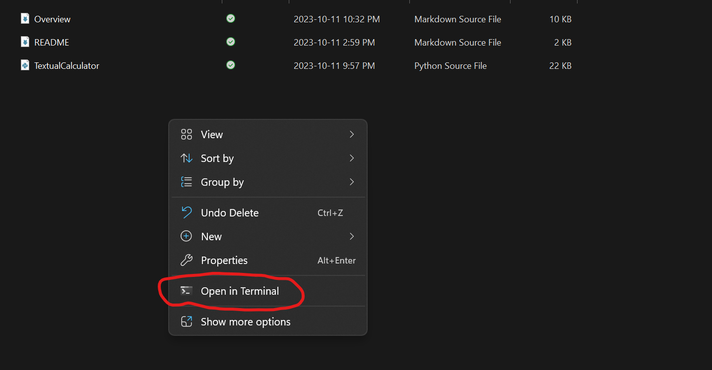

[](https://classroom.github.com/a/kCrKdl4V)
# ExplorationActivity2: Textual Calculator (Matrix Addition)
## Table of Contents
1. [Which Package/Library](#which-package/library)
2. [How To Run The Program](#how-to-run-the-program)
3. [What Is The Purpose](#what-is-the-purpose)
4. [Some Sample Input/Output](#some-sample-input/output)
***
### Which Package/Library
For the second exploration activity, I decided to use pytorch as my library of choice. It also has numpy and some others but they are only used to support the math and debugging.
***
### How To Run The Program
The program is pretty easy to run, but before you are able to run you will likely need to install numpy and pytorch:

#### To install numpy: [https://numpy.org/install/]
1. Use the following command in the terminal

    `pip install numpy`

    If that doesn't work for you there should be a more indepth guide on the website above.

#### To install pytorch: [https://pytorch.org/get-started/locally/]
1. On the above website there is an area where you can select specifications 
    
    (I used the default settings it gave me but they may differ based on your computer, and as long as you have Stable 2.1.1 as the build ver. It should be able to be run the program)

2. After you selected what you need it'll give you a command to run in your terminal (however if you only have a lab computer you will likely not be able to install it as it is a large library)

#### How To Run The Program (Steps)


1. Simply navigate to the folder where the Textual_Calculator.py is.
2. Right click on the empty space, and select the 'open in terminal' option.

3. If that isn't an option copy the path of the folder and open the terminal and use: ```cd <PATH>```
4. Then use: ```python Textual_Calculator.py``` 

This will start the program.
***
### What Is The Purpose
The purpose of this program is that it is an easily expandable text interpreter that has several modes, and in the initial select mode part you can ask for a explaination of the modes. 

In the normal mode it can evaluates expressions, conditionals, and comparisons.  

In the matrix mode (NEW) it can create matrix variables and use them in simple matrix arithmetic.

With some additions it may replace the default calculator given to you by your os.
***
### Some Sample Input/Output
```
PS <PATH> python TextualCalculator.py
Input a cmd: 'Explain matrix'
In the matrix mode you can assign matrix variables (<A-Z>[<num>] = [x11,x21,x31;x21,x22,x23;x31,x32,x33]),
evaluate matrix expressions (3 + A, V.V, M M^-1, ...)
currently supports
    determinants, inverse, trace, transpose
    vector products (dot "." and cross "#")
    matrix multiplication ([...] [...])
    element wise operations (+ - * / ^)
Input a cmd: 'Matrix'
Welcome to Matrix mode (to make a matrix use <VAR> = [] with , between elements of a row and ; between rows)
Input a statement to evaluate: 'T = [1,2,3]' 
Input a statement to evaluate: 'H = [9,1,4]'
Input a statement to evaluate: 'T.H'
ANSWER: 23.0
Input a statement to evaluate: 'T#H'
ANSWER:
┌
. 5.0 23.0 -17.0
                 ┘
Input a statement to evaluate: 'S = [8,4;3,12]'
Input a statement to evaluate: 'det(S)'
ANSWER: 84.0
Input a statement to evaluate: 'tr(S)'
ANSWER: 20.0
Input a statement to evaluate: '.'
Input a cmd: 'close'
PS <PATH> ...
```
User input is in 'single quotes' as to differentiate it, they are not needed when using the program.